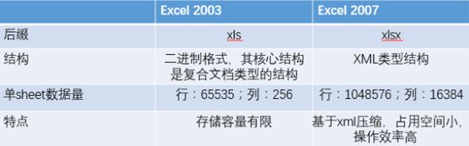

# excel操作示例

## 概述

### Excel的两种版本

目前世面上的Excel分为两个大的版本Excel2003和Excel2007及以上两个版本；
两者之间的区别如下：

Excel2003 是一个特有的二进制格式，其核心结构是复合文档类型的结构，存储数据量较小；

Excel2007 的核心结构是 XML 类型的结构，采用的是基于 XML 的压缩方式，使其占用的空间更小，操作效率更高

### POI操作Excel高低版本区别

在POI包中有如下几个主要对象和excel的几个对象对应：

| 对应excel名称 | 低版本中的类名 | 高版本中的类名 |
| :------------ | :------------- | :------------- |
| 工作簿        | HSSFWorkbook   | XSSFWorkbook   |
| 工作表        | HSSFSheet      | XSSFSheet      |
| 行            | HSSFRow        | XSSFRow        |
| 单元格        | HSSFCell       | XSSFCell       |
| 单元格样式    | HSSFCellStyle  | XSSFCellStyle  |

## 推荐

**强烈推荐使用easyexcel，理由：**

1. 操作简单快捷
2. 解决原生POI在SAX模式下的内存溢出的问题
3. 文档完善

easyexcel地址：https://github.com/alibaba/easyexcel

easyexcel文档：https://www.yuque.com/easyexcel/doc/easyexcel